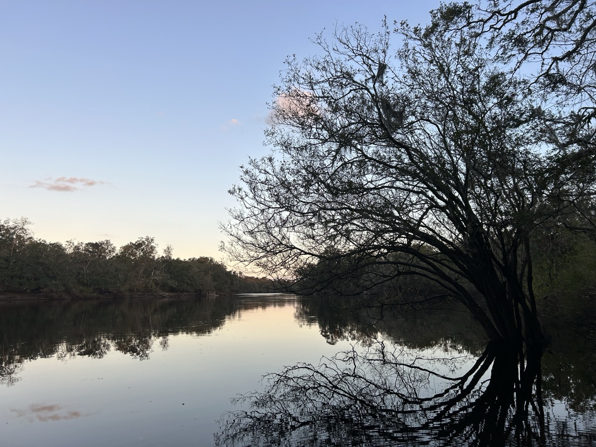

# My First Coding Assignment #

## About Me ##
I currently work as a Multimedia Communication Specialist for a healthcare software company. I'm a department of one so I handle all of our social media, email marketing, print design, and web design work. In my free time I enjoy outdoor activities such as hiking and backpacking.

## Past Coding Experience ##
I took a web design class in undergrad that covered basic HTML and CSS. As part of my current job we use SquareSpace for our website but I've added some custom code using html, css, and javascript to make our website more unique than what's avaliable out of the box.

## Career Goals ##
<ol type="1">
<li>Remote job</li>
<li>Livable Wage</lii>
<li>Boss who respects me</li>
<li>Employer that encourages continuing education</li>
</ol>
